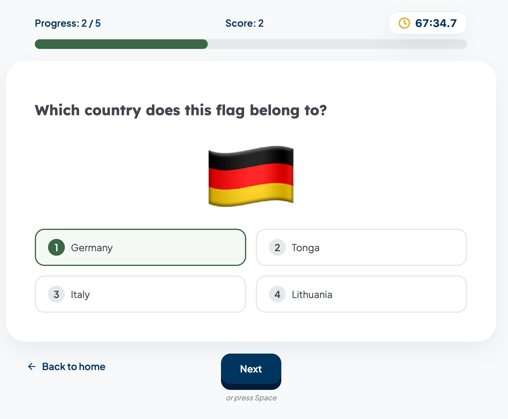

# Geo Quiz

Browser quiz: match country flags to names, track how you do over time.



- Demo: https://geo-quiz-phi.vercel.app/
- Storybook: https://geo-quiz-storybook-nf449ky6o-romankrrus-projects.vercel.app

## Features

- Flag-to-country rounds with immediate feedback
- Configurable round length
- Local statistics after completed rounds

## Tech stack

React 19 · TypeScript · Vite · TanStack Router · vanilla-extract

## Local development

```sh
npm install
npm run dev
```
